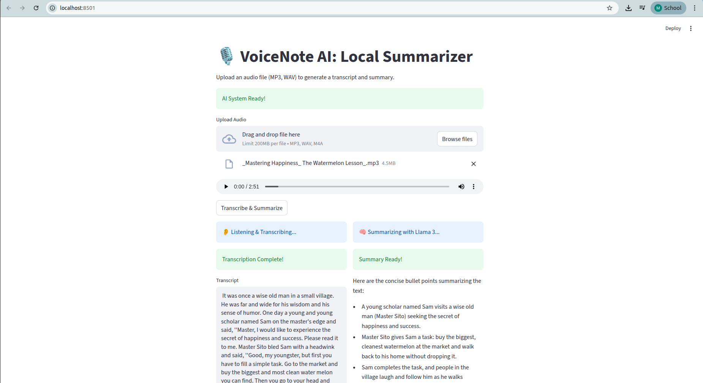

# 🎙️ VoiceNote AI: Local Audio Summarizer

**VoiceNote AI** is a privacy-focused tool that transcribes audio notes and summarizes them into actionable bullet points entirely offline.

## 🚀 Features
* **Multi-Modal AI:** Converts Audio to Text, then Text to Summary.
* **Privacy-First:** Uses local models (Whisper & Llama 3) so no data leaves your PC.
* **Universal Support:** Accepts MP3, WAV, and M4A files.
* **Smart Summaries:** Extracts key points using Llama 3.

## 🛠️ Tech Stack
* **Python 3.10+**
* **OpenAI Whisper** (Local Speech-to-Text)
* **Ollama (Llama 3)** (Local LLM)
* **Streamlit** (Frontend)

## 📸 Demo
 
*(Note: Make sure your uploaded image is named demo.png or change this line!)*

## 📦 How to Run
1.  Clone the repo:
    ```bash
    git clone https://github.com/MalindaBotheju/VoiceNote-AI.git
    ```
2.  Install dependencies:
    ```bash
    pip install -r requirements.txt
    ```
3.  Install FFmpeg (Linux):
    ```bash
    sudo apt install ffmpeg
    ```
4.  Run the app:
    ```bash
    streamlit run app.py
    ```
