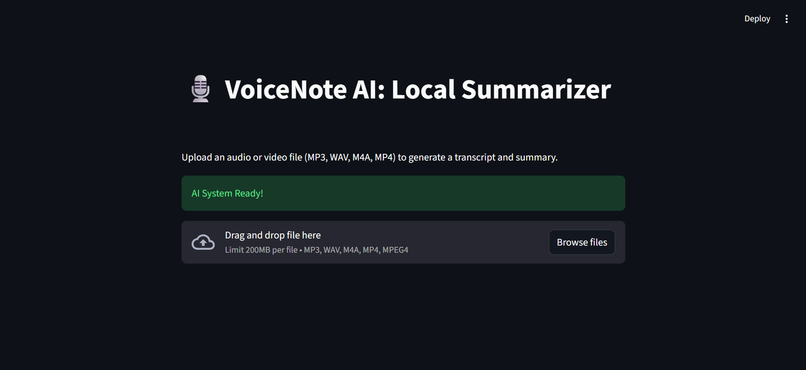
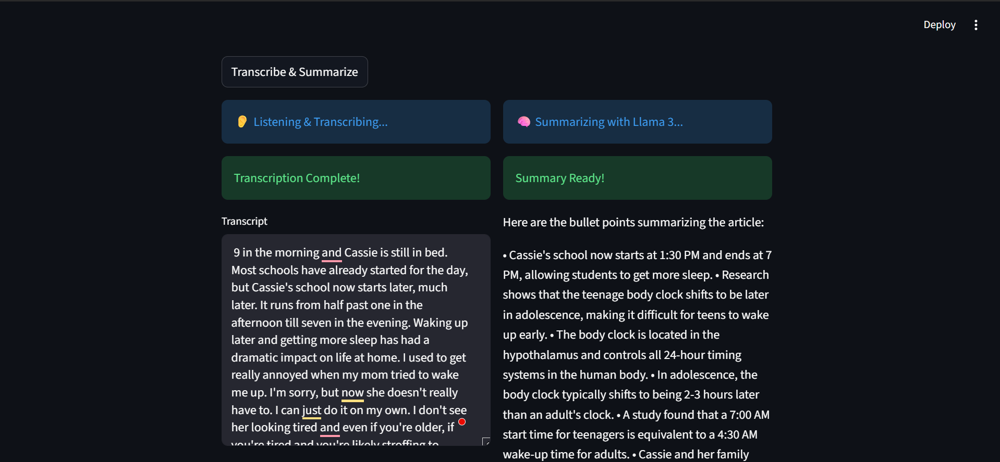

# 🎙️ VoiceNote AI: Local Summarizer

VoiceNote AI is a completely free, privacy-first, local web application that transcribes audio and video files and generates concise bullet-point summaries. 

It leverages **OpenAI's Whisper** for highly accurate speech-to-text and **Meta's Llama 3** (via Ollama) for intelligent summarization. Designed with a "Lean Docker" architecture, it ensures stability by running the app logic in a lightweight container while offloading heavy AI processing to the host machine.

## ✨ Features
* **100% Local & Private:** No data is sent to the cloud. Everything runs on your hardware.
* **Multi-Format Support:** Upload `.mp3`, `.wav`, `.m4a`, and `.mp4` files.
* **High-Accuracy Transcription:** Powered by Whisper (Base model).
* **Smart Summarization:** Extracts key points using Llama 3.
* **Lean Docker Setup:** Prevents "Out of Memory" crashes by keeping the Docker container small and connecting to the host machine's AI models.

## 📸 Screenshots

**VoiceNote Dashboard**


**Transcription & Summary**


---

## 🛠️ Tech Stack
* **Frontend/Backend:** Python 3.10, Streamlit
* **Audio Processing:** FFmpeg, OpenAI Whisper
* **LLM Engine:** Ollama, Llama 3
* **Containerization:** Docker

---

## 🚀 Step-by-Step Local Setup & Run Instructions

Follow these instructions to get VoiceNote AI running on your local machine.

### Step 1: Prerequisites
Before running the project, ensure you have the following installed on your computer:
1. **Git:** Installed on your machine.
2. **Docker:** Installed and running (Docker Desktop or Docker Engine).
3. **Ollama:** Download and install for your operating system from [ollama.com](https://ollama.com/).

### Step 2: Clone the Repository
Open your terminal and clone this project to your local machine, then navigate into the folder:
```bash
git clone https://github.com/MalindaBotheju/VoiceNote-AI
```
```bash
cd VoiceNote-AI
```

### Repository Structure
After cloning, ensure your project directory contains the following structure:

```text
VoiceNote-AI/
├── screenshots/      (Contains images used in this README)
├── .dockerignore     (Crucial: Keeps Docker builds fast by ignoring venv, etc.)
├── .gitignore        (Tells Git which local files to ignore)
├── Dockerfile        (Instructions to build the lightweight Python image)
├── README.md         (This documentation file)
├── app.py            (The main Streamlit application code)
└── requirements.txt  (Python dependencies: streamlit, openai-whisper, ollama)
```

### Step 3: Set Up the Local Virtual Environment (For Development)
Now that you are inside the folder, create and activate the virtual environment so your IDE has a clean workspace. 

**For Windows:**
```bash
python -m venv venv
```
```bash
.\venv\Scripts\Activate
```

**For Linux / macOS:**
```bash
python3 -m venv venv
```
```bash
source venv/bin/activate
```

### Step 4: Install the dependencies locally
```bash
pip install -r requirements.txt
```

### Step 5: Prepare the AI Model (Ollama)
Open your terminal and pull the Llama 3 model into your local Ollama instance:
```bash
ollama run llama3
```
(Once it downloads and starts, you can type ```/bye``` to exit. Ollama will keep running in the background).

### Step 6: Build the Docker Image
Open your terminal inside the VoiceNote-AI project folder and build the container image.
```bash
docker build -t voicenote-app .
```
Note: This will download Python and FFmpeg. It may take a few minutes the first time.

### Step 7: Run the App
Run the container using the following command. This specifically maps the port and tells the Docker container to look for Ollama on your host machine (host.docker.internal), preventing memory crashes.

```bash
docker run -p 8501:8501 -e OLLAMA_BASE_URL=http://host.docker.internal:11434 voicenote-app
```
(Optional: Add -d after run if you want it to run in the background).

### Step 8: Use the App
* Open your web browser.
* Navigate to: http://localhost:8501
* Upload an audio or video file, click "Transcribe & Summarize", and enjoy!
(Note on first run: Whisper will automatically download its base model (~139MB) the first time you transcribe a file. Subsequent runs will be much faster.)

---

## 👨‍💻 Created By

**Malinda Botheju** * GitHub: [@MalindaBotheju](https://github.com/MalindaBotheju)